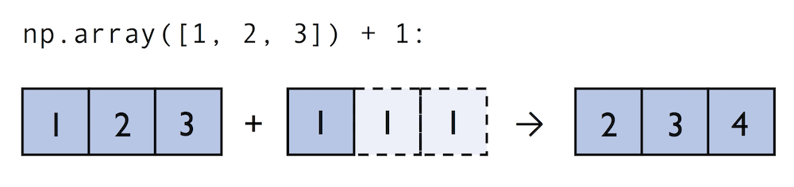
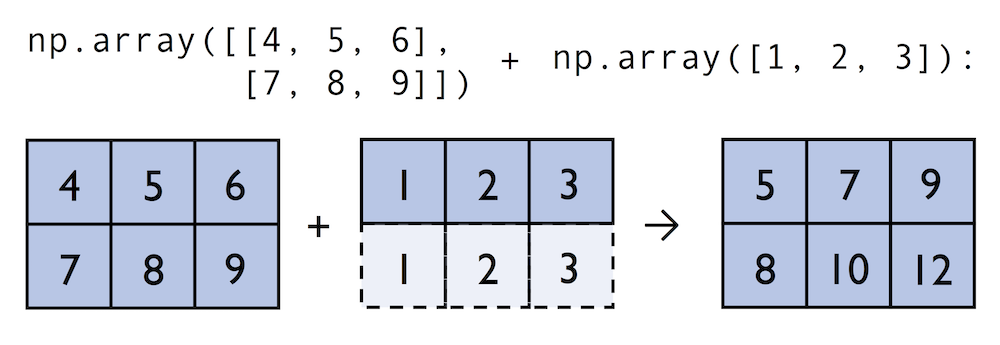
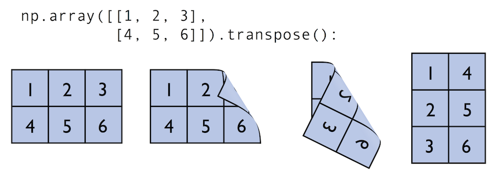

<h1> Numpy基础教程（一）narray对象</h1>

[TOC]

Numpy最重要的特点就是其N维数组（ndarray）对象，它就相当于一个打的数据容器，你可以利用数组对整个数据进行一些数学运算，而且语法与标量运算相同，因此使用起来非常方便。

# 1. 创建ndarray

通常创建数组的函数有如下几种：

- `array`：将输入数据（列表，元组，字符串等python序列类型转换成ndarray。数据类型可以由numpy自动推断，也可以显式指定）
- `asarray`：将输入数据转换成ndarray。
- `arange`：类似于python内置函数range，但arange函数返回ndarray，而不是列表。
- `ones`, `ones_like`：`ones`函数根据指定形状和数据类型创建全是１的数组。`ones_like`以另一个数组为参数，根据该数组的形状和数据类型创建全１的数组。
- `zeros`, `zeors_like`：类似于`ones`和`ones_like`函数，创建全０的数组。
- `empty`, `empty_like`：创建新数组，只分配内存，不填充任何值。
- `eye`, `identity`：创建一个正方形单位矩阵（对角线为１，其余为０）。
- `diag`：创建一个对角矩阵数组。
- `linsacpe`：在线性空间创建数组，可将指定将上下限范围均分成n份。
- `logspace`：类似`linspace`函数，但是在对数空间，相当于$$base^{lower}-base^{upper}$$。默认base为10。
- `fromiter`：通过迭代创建数组。

```python
import numpy as np

l = [1, 2, 3, 4]

array_func = np.array(l)
#> array([1, 2, 3, 4])

asarray_func = np.asarray(l)
#> array([1, 2, 3, 4])

arange_func = np.arange(1, 9, 2)
#> array([1, 3, 5, 7])

ones_func = np.ones((4, 5))
#> array([[1., 1., 1., 1., 1.],
#>        [1., 1., 1., 1., 1.],
#>        [1., 1., 1., 1., 1.],
#>        [1., 1., 1., 1., 1.]])

ones_like_func = np.ones_like(array_func)
#> array([1, 1, 1, 1])

eye_func = np.eye(4)
#> array([[1., 0., 0., 0.],
#>        [0., 1., 0., 0.],
#>        [0., 0., 1., 0.],
#>        [0., 0., 0., 1.]])

identity_func = np.identity(3)
#> array([[1., 0., 0.],
#>        [0., 1., 0.],
#>        [0., 0., 1.]])

diag_func = np.diag((3, 3, 3))
#> array([[3, 0, 0],
#>        [0, 3, 0],
#>        [0, 0, 3]])

linspace_func = np.linspace(0., 1., num=5)
#> array([ 0.  ,  0.25,  0.5 ,  0.75,  1.  ])

logspace_func = np.logspace(0., 1., num=5)
#> array([ 1.        ,  1.77827941,  3.16227766,  5.62341325, 10.        ])

def generator():
    for i in range(10):
        if i % 2:
            yield i

gen = generator()
np.fromiter(gen, dtype=int)
#> array([1, 3, 5, 7, 9])

#用列表推导式可等效于上面的generator
generator_expression = (i for i in range(10) if i % 2)
np.fromiter(generator_expression, dtype=int)
#> array([1, 3, 5, 7, 9])
```

**ndarrays说明：**


```python
import numpy as np

arr = np.array([[1, 2, 3], [4, 5, 6], dtype='int64')

# 数组每个元素占用内存大小（bytes）
arr.itemsize
#> 8

# 数组中包含多少个元素
arr.size
#> 6

# 数组维度
arr.ndim
#> 2

# 数组形状
arr.shape
#> (2, 3)
```

**函数说明：**

 - array和asarray函数接收等长序列组成的嵌套序列时将会转化成多维数组。

 ```python
import numpy as np

l = [[1, 2, 3], [4, 5, 6]]
a = np.array(l)

 #> array([[1, 2, 3],
 #>        [1, 2, 3]])
 ```

 - array和asarray的区别？

`array`和`asarray`都可以将数据转换成ndarray，主要的区别是当输入数据是ndarraay时，array会复制出一个副本，占用新的内存，而asarray不会。

```python
import numpy as np

arr1=np.ones((3,3))  
arr2=np.array(arr1)  
arr3=np.asarray(arr1)  
arr1[1]=2  
print 'arr1:\n',arr1  
print 'arr2:\n',arr2  
print 'arr3:\n',arr3  

#> arr1:  
#>   [[ 1.  1.  1.]  
#>    [ 2.  2.  2.]  
#>    [ 1.  1.  1.]]  
#> arr2:  
#>   [[ 1.  1.  1.]  
#>    [ 1.  1.  1.]  
#>    [ 1.  1.  1.]]  
#> arr3:  
#>   [[ 1.  1.  1.]  
#>    [ 2.  2.  2.]  
#>    [ 1.  1.  1.]]  
```
 - `empty`函数并不是返回一个空的ndarray，而是返回一些未初始化的垃圾值。

```python
import numpy as np

a = np.empty((2, 3))

#> array([[0.00000000e+000, 6.92305744e-310, 6.92305743e-310],
#>        [6.92304506e-310, 6.92305390e-310, 6.92305390e-310]])
```

# 2. ndarray的数据类型

dtype(data type)是一个特殊的对象，它包含ndarray将一块内存解释为特定数据类型的所需信息。

Numpy所支持的全部数据类型如下表：
|类型 |类型代码 |说明 |
|-|-|-|
|int8, uint8|i1, u1 |有符号和无符号8位（１字节）整型 |
|int16, uint16|i2, u2|有符号和无符号16位（２字节）整型|
|int32, uint32|i4, u4|有符号和无符号32位（4字节）整型|
|int64, uint64|i8, u8|有符号和无符号64位（8字节）整型|
|float16|f2|半精度浮点数|
|float32|f4或f|标准的单精度浮点数|
|float64|f8或d|标准的双精度浮点数|
|float128|f16或g|扩展精浮点数|
|complex64, complex128, complex256|c8, c16, c32|分别用32位，64位，128位浮点数表示的复数|
|bool|?|布尔类型|
|object|O|python对象类型|
|string_|S|固定长度的字符串类型，例如创建长度为10的字符串，应用S10|
|unicode_|U|固定长度的unicode类型，类似字符串|

在创建ndarray时，如果不指定dtype，numpy会自动判断类型，也可以人为指定数据类型。

```python
import numpy as np

arr = np.array([1, 2, 3, 4])
arr.dtype
#> dtype('int64')

arr1 = np.array([1, 2, 3, 4], dtype='int8')
arr.dtype
#> dtype('int8')
```

我们也可以通过以下几种方式改变ndarray的数据类型

- 赋值
- `astype`方法

```python
import numpy as np

arr = np.array([1, 2, 3, 4], dtype='float16')

arr.dtype = 'int8'
arr.dtype
#> dtype('int8')

arr = arr.astype(np.float64)
arr.dtype
#> dtype('float64')
```

**注意：**

- 使用`astype`无论如何都会创建一个新的数组，即使新的数组和老的数组相同，也会拷贝原始数组。
- 浮点数只能近似表示分数值。在复杂的计算中可能会积累浮点错误，因此比较操作符只在有效小数位内有效。

# 3. 数组与标量之间的运算

数组相对列表最大的优势就是不需要循环就可以对数据进行批量运算，即矢量化（向量化，vectorization）。
- 数组与数组运算

形状相同的数组之间任何算术运算都会应用到各个元素。

```python
import numpy as np

a = np.array([[1, 2, 3],[4, 5, 6]])
b = np.array([[7, 8, 9],[10, 11, 12]])

a + b
#> array([[ 8, 10, 12],
#>        [14, 16, 18]])

a * b
#> array([[ 7, 16, 27],
#>        [40, 55, 72]])
```

形状不同的数组之间的运算叫做广播（broadcast）。Numpy数组运算通常是逐元素计算，因此要求数组的形状必须相同。但broadcast机制解除了这种限制，当两个数组的形状满足某种条件时，不同形状的数组也可以进行运算。

> **Broadcasting规则[^1]**
>
>当两个数组进行算术运算时，numpy从前向后逐元素比较两个数组的形状。当比较的元素值满足以下条件时，我们认为满足broadcasting条件：
>
>１．相等
>２．其中一个是１
>
>当不满足时，会抛出 ValueError: frames are not aligne 异常。算术运算的结果的形状的每一元素，是两个数组形状逐元素比较时的最大值。
>
>而且，两个数组可以有不同的维度。比如一个 ```256x256x3``` 的数组储存 RGB 值，如果对每个颜色通道进行不同的放缩，我们可以乘以一个一维、形状为 ```(3, ) ```的数组。因为是从后向前比较，因此 ```3 == 3```，符合 Broadcasting规则 。

```python
np.array([1, 2, 3]) + 1

#> array([2, 3, 4])
```


```python
np.array([[4, 5, 6], [7, 8, 9]]) + np.array([1, 2, 3])

#> array([[5, 7, 9],
#>        [8, 10, 12]])
```


```python
A      (4d array):  8 x 1 x 6 x 1
B      (3d array):      7 x 1 x 5
Result (4d array):  8 x 7 x 6 x 5

A      (2d array):  5 x 4
B      (1d array):      1
Result (2d array):  5 x 4

A      (2d array):  5 x 4
B      (1d array):      4
Result (2d array):  5 x 4

A      (3d array):  15 x 3 x 5
B      (3d array):  15 x 1 x 5
Result (3d array):  15 x 3 x 5

A      (3d array):  15 x 3 x 5
B      (2d array):       3 x 5
Result (3d array):  15 x 3 x 5

A      (3d array):  15 x 3 x 5
B      (2d array):       3 x 1
Result (3d array):  15 x 3 x 5
```

[^1]: [TensorFlow 和 NumPy 的 Broadcasting 机制](https://lufficc.com/blog/tensorflow-and-numpy-broadcasting)

- 数组与标量的运算

数组与标量的运算也会将变量值传播到数组中的各个元素。

```python
import numpy as np

np.array([1, 2, 3]) * 2
#> array([2, 4, 6])
```
# 4. 索引和切片

## 4.1 基础索引和切片

一维数组索引和切片与列表类似：

```python
arr = np.array([1, 2, 3])
arr[0]
#> 1

arr[:2]
#> array([1, 2])
```

高维数组可以采用与列表一样的索引和切片操作，但numpy提供了一种更方便的索引方式：

```python
arr = np.array([[1, 2, 3], [4, 5, 6], [7, 8, 9])
arr[0][1]
#> 2

arr[0, 1]
#> 2

arr[:2][:2]
#> array([[1, 2],
#>        [4, 5]])

arr[:2, :2]
#> array([[1, 2],
#>        [4, 5]])
```
**注意：**
对array的索引赋值会改变原数组，同样对切片赋值也会广播到整个切片。也就是说numpy不会复制数组，因为numpy面向大数据处理，如果频繁复制数据会对性能和内存产生极大影响。所以在使用ndarray时需要注意这一点。如果需要复制数组，那么需要显式复制操作。

```python
arr = np.array([1, 2, 3, 4])

arr[1:3] = 9
arr
#> array([1, 9, 9, 4])

#需要复制时，要用copy
arr[1:3].copy() = 9
arr
#> array([1, 2, 3, 4])
```

## 4.1 布尔索引

来看一个例子：假设我们有一个存储数据的数组和一个存储姓名的数组，两个数组有相同的行数。假设每个名字对应一条数据，我们现在想选出名字为‘Bob’的数据。

```python
import numpy as np

names = np.array(['Bob','Joe','Will','Joe','Bob','Will','Joe','Jim'])
data = np.randn(8, 4)
names
#> array(['Bob', 'Joe', 'Will', 'Joe', 'Bob', 'Will', 'Joe', 'Jim'],      dtype='<U4')
data
#> array([[ 1.12232318,  0.43162667, -1.3618831 , -0.48468892],
#>        [-2.80077701, -1.60805531,  0.61305063,  1.55733827],
#>        [-0.80557176,  0.02005289,  0.1798058 , -0.11551892],
#>        [-0.98140298,  1.66986983,  0.30672708, -0.80062988],
#>        [ 1.35585722,  2.82857382, -0.23053317, -0.51183021],
#>        [ 1.22425324data[names == 'Bob', 2:],  0.72373285, -0.05037383,  0.26113532],
#>        [ 0.61232838, -1.27510466,  1.38222318,  1.29352911],
#>        [ 0.58946335, -0.66153124, -0.21035064, -0.85219484]])

names == 'Bob'
#> array([ True, False, False, False,  True, False, False, False])

data[names == 'Bob']
#> array([[ 1.12232318,  0.43162667, -1.3618831 , -0.48468892],
#>        [ 1.35585722,  2.82857382, -0.23053317, -0.51183021]])
```

- 布尔型索引还可以跟切片，整数（或整数列表）混合使用。

```python
data[names == 'Bob', 2:]

#> array([[-1.3618831 , -0.48468892],
#>        [-0.23053317, -0.51183021]])
```
- 多条件布尔索引——布尔运算

```python
data[(names == 'Bob') | (names == 'Will')]

#> array([[ 1.12232318,  0.43162667, -1.3618831 , -0.48468892],
#>        [-0.80557176,  0.02005289,  0.1798058 , -0.11551892],
#>        [ 1.35585722,  2.82857382, -0.23053317, -0.51布尔索引的一个重要应用就是183021],
#>        [ 1.22425324,  0.72373285, -0.05037383,  0.26113532]])
```
> 注意：and, or等关键字在此处无效。

- `where`函数。我们可以通过`where`函数很方便的查找到满足条件的数据索引位置。

```python
import numpy as np

arr = np.random.randn(10)
print("Array: ", arr_rand)
#> Array:  [-0.26668429  1.74213686  0.81311102  1.2670808  -0.42671825 -0.5409184
#>          0.14577403 -0.07287565  0.43057498  1.22411712]

# 大于1的数据位置
index_gt1 = np.where(arr > 1)
print("Positions where value > 1: ", index_gt1)
#> Positions where value > 1:  (array([1, 3, 9]),)

# 最大值位置
print('Position of max value: ', np.argmax(arr))  array(['le1', 'gt1', 'le1', 'gt1', 'le1', 'le1', 'le1', 'le1', 'le1',
       'gt1'], dtype='<U3')
#> Position of max value:  1

# 最小值位置
print('Position of min value: ', np.argmin(arr))  
#> Position of min value:  5
```
有了索引位置，我们就可以通过`take`方法来获取数值：
```python
arr.take(index_gt1)

#> array([[1.74213686, 1.2670808 , 1.22411712]])
```

`where`函数可以额外接收两个参数——x, y。满足条件的数据设置成’x’，否则为’y’。

```python
# 把大于1的值设为‘gt1’，否则为'le1'
np.where(arr > 1, 'gt1', 'le1')

#> array(['le1', 'gt1', 'le1', 'gt1', 'le1', 'le1', 'le1', 'le1', 'le1',
#>        'gt1'], dtype='<U3')
```

## 4.2 花式索引

话是索引指的是利用整数列表或数组进行索引。

```python
data[[0, 1, 3]]
#> array([[ 1.12232318,  0.43162667, -1.3618831 , -0.48468892],
#>        [-2.80077701, -1.60805531,  0.61305063,  1.55733827],
#>        [-0.98140298,  1.66986983,  0.30672708, -0.80062988]])
```

当一次传入多个数组或列表时，得到的是一个一维数组：

```python
arr = np.arange(32).reshape((8, 4))
arr
#> array([[ 0,  1,  2,  3],
#>        [ 4,  5,  6,  7],
#>        [ 8,  9, 10, 11],
#>        [12, 13, 14, 15],
#>        [16, 17, 18, 19],
#>        [20, 21, 22, 23],
#>        [24, 25, 26, 27],
#>        [28, 29, 30, 31]])

arr[[1, 2, 3],[0, 2, 1]]
#> array([ 4, 10, 13])
```
最终选出来的是(1, 0), (2, 2), (3, 1)的数据。为了得到一个矩形区域的数据，我们有两种方法。
```python
# 方法一：
arr[[1, 2, 3]][:,[0, 2, 1]]
#> array([[ 4,  6,  5],
#>        [ 8, 10,  9],
#>        [12, 14, 13]])

# 方法二：
arr[np.ix_([1, 2, 3],[0, 2, 1])]
#> array([[ 4,  6,  5],
#>        [ 8, 10,  9],
#>        [12, 14, 13]])
```

# 5. 数组转置与轴对换

矩阵运算时，经常需要对数组进行转置。转置的方法主要有两种：`transpose`和`T`。

```python
matrix = np.array([[1, 2, 3],
                   [4, 5, 6]])
matrix.transpose()
#matrix.T

#> array([[1, 4],
#>        [2, 5],
#>        [3, 6]])
```

