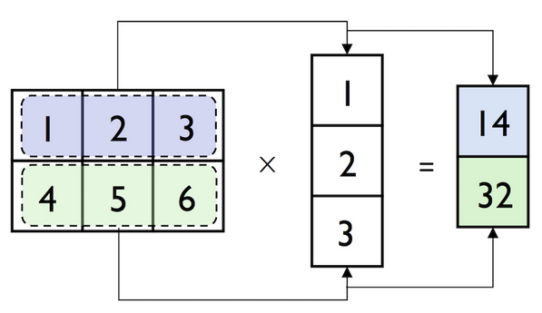

<h1>Numpy基础教程（五）线性代数</h1>

[TOC]

线性代数是任何数组库的重要组成部分，Numpy提供了一组函数来满足矩阵计算。

Numpy本身也提供了[matrix](https://docs.scipy.org/doc/numpy/reference/generated/numpy.matrix.html)类型，类似于array，但是是严格的二维的。并且matrix运算操作符的定义也与array不同，比如`*`对数组来说，是计算元素级的乘积，而不是两个矩阵相乘，而matrix类型的`*`就代表矩阵相乘。然而Numpy中的matrix类型并不常用，且Numpy也提供了一系列函数或方法实现矩阵运算，因此我们这里不对matrix过多介绍，主要还是介绍`array`。

# 常用线性代数函数

```python
row_vector = np.array([1, 2, 3])
column_vector = np.array([[1, 2, 3]]).reshape(-1, 1)

row_vector
column_vector

#> array([1, 2, 3])
#> array([[1],
#>        [2],
#>        [3]])
```
另外，`np.newaxis`和`None`，也可以产生和`reshape`相同的结果：

```python
row_vector[:, np.newaxis]
#> array([[1],
#>        [2],
#>        [3]])

row_vector[:, None]
#> array([[1],
#>        [2],
#>        [3]])
```

- `dot`, `matmul`：矩阵乘法。

```python
matrix = np.array([[1, 2, 3],
                   [4, 5, 6]])
np.matmul(matrix, column_vector)
# 或np.dot(matrix, column_vector)
# 或matrix.dot(column_vector)

#> array([[14],
#>        [32]])
```



`dot`和`matmul`使用不同方法实现的矩阵乘法，区别就在于，不同的机器或不同的[BLAS](https://en.wikipedia.org/wiki/Basic_Linear_Algebra_Subprograms)版本，两者的运算速度不同。


- `trace`：计算对角元素之和。

```python
matrix = np.arange(16).reshape(4,4)
matrix
#> array([[ 0,  1,  2,  3],
#>        [ 4,  5,  6,  7],
#>        [ 8,  9, 10, 11],
#>        [12, 13, 14, 15]])

np.trace(matrix)
#> 30
```

- `det`：计算矩阵行列式。

```python
np.linalg.det(matrix)
#> 0.0
```

- `eig`：计算本征值和本征向量。

```python
np.linalg.eig(matrix)
#> (array([ 3.24642492e+01, -2.46424920e+00,  2.14966418e-15, -1.17200157e-16]),
#>  array([[-0.11417645,  0.7327781 , -0.40377562,  0.05533605],
#>         [-0.3300046 ,  0.28974835,  0.81421492,  0.33237807],
#>         [-0.54583275, -0.15328139, -0.41710299, -0.83076428],
#>         [-0.76166089, -0.59631113,  0.00666369,  0.44305017]]))
```

- `inv`：计算方阵的逆。

```python
a = np.array([[1, 2],[3, 4]])
np.linalg.inv(a)

#> array([[-1.66666667,  0.66666667],
#>        [ 1.33333333, -0.33333333]])
```

- `pinv`：计算矩阵的Moore-Penrose伪逆。

```python
np.linalg.pinv(matrix)

#> array([[-2.62500000e-01, -1.37500000e-01, -1.25000000e-02,
#>          1.12500000e-01],
#>        [-1.00000000e-01, -5.00000000e-02,  2.06320288e-17,
#>          5.00000000e-02],
#>        [ 6.25000000e-02,  3.75000000e-02,  1.25000000e-02,
#>         -1.25000000e-02],
#>        [ 2.25000000e-01,  1.25000000e-01,  2.50000000e-02,
#>         -7.50000000e-02]])
```

- `qr`：计算QR分解。

```python
np.linalg.qr(matrix)

#> (array([[ 0.        , -0.83666003,  0.54061686,  0.08793982],
#>         [-0.26726124, -0.47809144, -0.78636895,  0.28569892],
#>         [-0.53452248, -0.11952286, -0.04911268, -0.8352173 ],
#>         [-0.80178373,  0.23904572,  0.29486477,  0.46157856]]),
#>  array([[-1.49666295e+01, -1.65701970e+01, -1.81737645e+01,
#>          -1.97773319e+01],
#>         [ 0.00000000e+00, -1.19522861e+00, -2.39045722e+00,
#>          -3.58568583e+00],
#>         [ 0.00000000e+00,  0.00000000e+00, -3.82019983e-15,
#>          -4.31063089e-15],
#>         [ 0.00000000e+00,  0.00000000e+00,  0.00000000e+00,
#>           7.74364831e-17]]))
```

- `svd`：计算奇异值分解。

```python
a = np.random.randn(9, 6)
b, c, d = np.linalg.svd(a, full_matrices=True)

b.shape
c.shape
d.shape

#> (9, 9)
#> (6,)
#> (6, 6)
```

- `solve`：解线性方程`Ax=b`, 其中A为方阵。

```python
a = np.array([[3,1], [1,2]])
b = np.array([9,8])
x = np.linalg.solve(a, b)
x

#> array([ 2.,  3.])
```

- `lstsq`：计算`Ax=b`的最小二乘解。

```python
# 通过一些数据点，拟合一条曲线“y = mx + c”
x = np.array([0, 1, 2, 3])
y = np.array([-1, 0.2, 0.9, 2.1])

# 检查系数可以发现斜率大概为１，截距大概为-1，我们可以把方程重写成“y = Ap”,其中A = [[X, 1]], P = [[m], [c]]

A = np.vstack([x, np.ones(len(x))]).T
A
#> array([[ 0.,  1.],
#>        [ 1.,  1.],
#>        [ 2.,  1.],
#>        [ 3.,  1.]])

m, c = np.linalg.lstsq(A, y)[0]
print(m, c)

#> 1.0 -0.95
```
