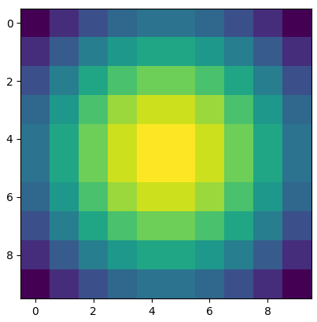

<h1> Numpy练习题</h1>

１．翻转向量

```python
Z = np.arange(50)
Z = Z[::-1]
#> array([49, 48, 47, 46, 45, 44, 43, 42, 41, 40, 39, 38, 37, 36, 35, 34, 33,
#>        32, 31, 30, 29, 28, 27, 26, 25, 24, 23, 22, 21, 20, 19, 18, 17, 16,
#>        15, 14, 13, 12, 11, 10,  9,  8,  7,  6,  5,  4,  3,  2,  1,  0])
```

２．找到[1, 2, 0, 0, 4, 0]中的非零元素索引

```python
nz = np.nonzero([1,2,0,0,4,0])
print(nz)
#> (array([0, 1, 4]),)
```

３．创建3x3单位矩阵

```python
Z = np.eye(3)
print(Z)
#> [[ 1.  0.  0.]
#>  [ 0.  1.  0.]
#>  [ 0.  0.  1.]]
```

４．创建一个二维矩阵，其中１位于边缘，０位于里面

```python
Z = np.ones((10,10))
Z[1:-1,1:-1] = 0
print(Z)
#> [[ 1.  1.  1.  1.  1.  1.  1.  1.  1.  1.]
#>  [ 1.  0.  0.  0.  0.  0.  0.  0.  0.  1.]
#>  [ 1.  0.  0.  0.  0.  0.  0.  0.  0.  1.]
#>  [ 1.  0.  0.  0.  0.  0.  0.  0.  0.  1.]
#>  [ 1.  0.  0.  0.  0.  0.  0.  0.  0.  1.]
#>  [ 1.  0.  0.  0.  0.  0.  0.  0.  0.  1.]
#>  [ 1.  0.  0.  0.  0.  0.  0.  0.  0.  1.]
#>  [ 1.  0.  0.  0.  0.  0.  0.  0.  0.  1.]
#>  [ 1.  0.  0.  0.  0.  0.  0.  0.  0.  1.]
#>  [ 1.  1.  1.  1.  1.  1.  1.  1.  1.  1.]]
```

５．下面这些表达式的输出是什么？

```python
0 * np.nan
np.nan == np.nan
np.inf > np.nan
np.nan - np.nan
0.3 == 3 * 0.1
#> nan
#> False
#> False
#> nan
# False
```

６．创建一个5x5的矩阵，其中1,2,3,4位于对角线下面

```python
Z = np.diag(1+np.arange(4),k=-1)
print(Z)
#> [[0 0 0 0 0]
#>  [1 0 0 0 0]
#>  [0 2 0 0 0]
#>  [0 0 3 0 0]
#>  [0 0 0 4 0]]
```

７．创建一个棋盘矩阵

```python
Z = np.zeros((8,8),dtype=int)
Z[1::2,::2] = 1
Z[::2,1::2] = 1
print(Z)
#> [[0 1 0 1 0 1 0 1]
#>  [1 0 1 0 1 0 1 0]
#>  [0 1 0 1 0 1 0 1]
#>  [1 0 1 0 1 0 1 0]
#>  [0 1 0 1 0 1 0 1]
#>  [1 0 1 0 1 0 1 0]
#>  [0 1 0 1 0 1 0 1]
#>  [1 0 1 0 1 0 1 0]]
```

８．考虑一个形状是(6,7,8)的数组，其第１００个元素的索引是什么？

```python
print(np.unravel_index(100,(6,7,8)))
#> (1, 5, 4)
```

９．归一化一个5x5的任意矩阵

```python
Z = np.random.random((5,5))
Zmax, Zmin = Z.max(), Z.min()
Z = (Z - Zmin)/(Zmax - Zmin)
print(Z)
#> [[ 0.4397074   1.          0.87961188  0.83404908  0.87945088]
#>  [ 0.43452726  0.7457726   0.91727564  0.1039192   0.43830211]
#>  [ 0.25531903  0.2608381   0.          0.47325113  0.52277037]
#>  [ 0.99662573  0.90782763  0.84675569  0.09047124  0.60243565]
#>  [ 0.30786439  0.87051229  0.07159354  0.57176141  0.59824867]]
```

１０．给定一个一维数组，将其中３到８之间的数全部取反：

```python
Z = np.arange(11)
Z[(3 < Z) & (Z <= 8)] *= -1
print(Z)
#> [ 0  1  2  3 -4 -5 -6 -7 -8  9 10]
```

１１．下面表达式将会输出什么？

```python
print(sum(range(5),-1))
from numpy import *
print(np.sum(range(5),-1))
#> 9
#> 10
```

１２．如何截取任意数组中数据整数部分

```python
Z = np.random.uniform(0,10,10)

print (Z - Z%1)
print (np.floor(Z))
print (np.ceil(Z)-1)
print (Z.astype(int))
print (np.trunc(Z))
#> [ 4.  8.  6.  2.  4.  5.  3.  8.  7.  9.]
#> [ 4.  8.  6.  2.  4.  5.  3.  8.  7.  9.]
#> [ 4.  8.  6.  2.  4.  5.  3.  8.  7.  9.]
#> [4 8 6 2 4 5 3 8 7 9]
#> [ 4.  8.  6.  2.  4.  5.  3.  8.  7.  9.]
```

１３．创建一个5x5的数组，其中每一行都是0-4的值。

```python
Z = np.zeros((5,5))
Z += np.arange(5)
print(Z)
#> [[ 0.  1.  2.  3.  4.]
#>  [ 0.  1.  2.  3.  4.]
#>  [ 0.  1.  2.  3.  4.]
#>  [ 0.  1.  2.  3.  4.]
#>  [ 0.  1.  2.  3.  4.]]
```

１４．如何使用生成器来创建一个数组？

```python
def generate():
    for x in range(10):
        yield x
Z = np.fromiter(generate(),dtype=float,count=-1)
print(Z)
#> [ 0.  1.  2.  3.  4.  5.  6.  7.  8.  9.]
```

１５．对一个小数组求和，速度比`np.sum()`更快?

```python
Z = np.arange(10)

%timeit np.add.reduce(Z)
#> 1000000 loops, best of 3: 1.01 µs per loop

%timeit np.sum(Z)
#> 100000 loops, best of 3: 2.15 µs per loop
```

１６．检查两个任意数组A和B是否相等？

```python
A = np.random.randint(0,2,5)
B = np.random.randint(0,2,5)
equal = np.allclose(A, B) # 误差范围内两个数组是否相等
print(equal)
#> False
```

１７．考虑一个10x2的矩阵，表示10个直角坐标系中的点，将他们转换到极坐标系？

```python
Z = np.random.random((10,2))
X,Y = Z[:,0], Z[:,1]
R = np.sqrt(X**2+Y**2)
T = np.arctan2(Y,X)
P = np.concatenate([R.reshape(10,1),T.reshape(10,1)], axis=1)
#> [[ 0.58649651  1.39949739]
#>  [ 0.29975535  0.87920539]
#>  [ 1.05272727  0.3395081 ]
#>  [ 0.79145468  1.24430285]
#>  [ 0.42579815  1.23885261]
#>  [ 0.44710607  1.50148139]
#>  [ 1.17613546  0.88400217]
#>  [ 1.17683422  0.64052336]
#>  [ 0.64888237  1.55279482]
#>  [ 1.04100245  0.68915878]]
```

１８．利用x, y坐标创建一个结构化数组，其中x, y覆盖范围为[0,1]x[0,1]?

```python
Z = np.zeros((5,5), [('x',float),('y',float)])
Z['x'], Z['y'] = np.meshgrid(np.linspace(0,1,5),
                             np.linspace(0,1,5))
print(Z)
#> [[( 0.  ,  0.  ) ( 0.25,  0.  ) ( 0.5 ,  0.  ) ( 0.75,  0.  ) ( 1.  ,  0.  )]
#>  [( 0.  ,  0.25) ( 0.25,  0.25) ( 0.5 ,  0.25) ( 0.75,  0.25) ( 1.  ,  0.25)]
#>  [( 0.  ,  0.5 ) ( 0.25,  0.5 ) ( 0.5 ,  0.5 ) ( 0.75,  0.5 ) ( 1.  ,  0.5 )]
#>  [( 0.  ,  0.75) ( 0.25,  0.75) ( 0.5 ,  0.75) ( 0.75,  0.75) ( 1.  ,  0.75)]
#>  [( 0.  ,  1.  ) ( 0.25,  1.  ) ( 0.5 ,  1.  ) ( 0.75,  1.  ) ( 1.  ,  1.  )]]
```

１９．考虑一个10x2的矩阵，就算任意两点的距离？

```python
Z = np.random.random((10,2))
X,Y = np.atleast_2d(Z[:,0]), np.atleast_2d(Z[:,1])
D = np.sqrt( (X-X.T)**2 + (Y-Y.T)**2)
print(D)

# 使用scipy可以更快
import scipy.spatial
D = scipy.spatial.distance.cdist(Z,Z)
print(D)
```

２０．产生一个二维高斯型数组？

```python
import matplotlib.pyplot as plt

X, Y = np.meshgrid(np.linspace(-1,1,10), np.linspace(-1,1,10))
D = np.sqrt(X*X+Y*Y)
sigma, mu = 1.0, 0.0
G = np.exp(-( (D-mu)**2 / ( 2.0 * sigma**2 ) ) )

plt.imshow(G)
plt.show()
```



２１．如何在二维数组中随机放置p个元素？

```python
n = 10
p = 3
Z = np.zeros((n,n))
np.put(Z, np.random.choice(range(n*n), p, replace=False),1)
print(Z)
#> [[ 0.  0.  0.  0.  0.  0.  0.  0.  0.  0.]
#>  [ 0.  0.  0.  0.  0.  0.  1.  0.  0.  0.]
#>  [ 0.  0.  0.  0.  0.  0.  0.  0.  0.  0.]
#>  [ 0.  0.  0.  0.  0.  0.  0.  0.  0.  0.]
#>  [ 0.  0.  0.  0.  1.  0.  0.  0.  0.  0.]
#>  [ 0.  0.  0.  0.  0.  0.  0.  0.  0.  0.]
#>  [ 0.  0.  1.  0.  0.  0.  0.  0.  0.  0.]
#>  [ 0.  0.  0.  0.  0.  0.  0.  0.  0.  0.]
#>  [ 0.  0.  0.  0.  0.  0.  0.  0.  0.  0.]
#>  [ 0.  0.  0.  0.  0.  0.  0.  0.  0.  0.]]
```

２２．如何基于第p列数组对整个数组进行排序？

```python
Z = np.random.randint(0,10,(3,3))
print(Z)
print(Z[Z[:,1].argsort()])
#> [[3 8 0]
#>  [4 9 7]
#>  [7 1 5]]
#> [[7 1 5]
#>  [3 8 0]
#>  [4 9 7]]
```

２３．如何检测一个二维数组是否包含全零的列？

```python
Z = np.random.randint(0,3,(3,10))
print(Z)
print(Z.any(axis=0).any())
#> [[1 2 0 2 2 1 0 0 2 2]
#>  [2 2 0 2 0 0 0 2 1 2]
#>  [1 0 0 2 2 1 1 2 0 0]]
#> True
```

２４．考虑向量[1, 2, 3, 4, 5], 怎样在每两个数之间插入３个０构成一个新的向量？

```python
Z = np.array([1,2,3,4,5])
nz = 3
Z0 = np.zeros(len(Z) + (len(Z)-1)*(nz))
Z0[::nz+1] = Z
print(Z0)
#> [ 1.  0.  0.  0.  2.  0.  0.  0.  3.  0.  0.  0.  4.  0.  0.  0.  5.]
```

２５．一个5x5x3的数组,如何与5x5的数组相乘？

```python
A = np.ones((5,5,3))
B = 2*np.ones((5,5))
print(A * B[:,:,None])
#> [[[ 2.  2.  2.]
#>   [ 2.  2.  2.]
#>   [ 2.  2.  2.]
#>   [ 2.  2.  2.]
#>   [ 2.  2.  2.]]
#>
#>  [[ 2.  2.  2.]
#>   [ 2.  2.  2.]
#>   [ 2.  2.  2.]
#>   [ 2.  2.  2.]
#>   [ 2.  2.  2.]]
#>
#>  [[ 2.  2.  2.]
#>   [ 2.  2.  2.]
#>   [ 2.  2.  2.]
#>   [ 2.  2.  2.]
#>   [ 2.  2.  2.]]
#>
#>  [[ 2.  2.  2.]
#>   [ 2.  2.  2.]
#>   [ 2.  2.  2.]
#>   [ 2.  2.  2.]
#>   [ 2.  2.  2.]]
#>
#>  [[ 2.  2.  2.]
#>   [ 2.  2.  2.]
#>   [ 2.  2.  2.]
#>   [ 2.  2.  2.]
#>   [ 2.  2.  2.]]]
```

２６．如何交换两行数据？

```python
A = np.arange(25).reshape(5,5)
A[[0,1]] = A[[1,0]]
print(A)
#> [[ 5  6  7  8  9]
#>  [ 0  1  2  3  4]
#>  [10 11 12 13 14]
#>  [15 16 17 18 19]
#>  [20 21 22 23 24]]
```

２７．给定一个数组C, 如何生成一个数组A使得np.bincount(A)=C?

```python
C = np.bincount([1,1,2,3,4,4,6])
A = np.repeat(np.arange(len(C)), C)
print(A)
#> [1 1 2 3 4 4 6]
```

关于numpy的练习题就总结这些，完整版在[100 numpy exercises](http://www.labri.fr/perso/nrougier/teaching/numpy.100/)，以及有一个偏重于机器学习的数据集处理的numpy练习题我没有总结，但是还有用的：[101 NumPy Exercises for Data Analysis (Python)](https://www.machinelearningplus.com/python/101-numpy-exercises-python/)。有时间做一做这些练习对提高数据处理能力很有帮助。
