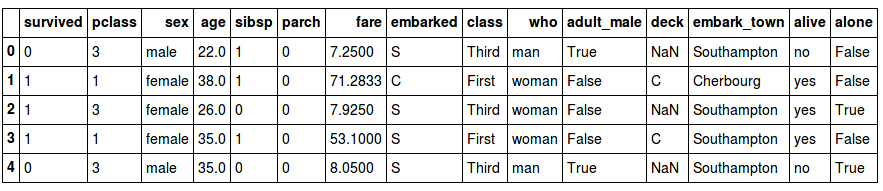

<h1>Pandas基础教程（九）pivot表</h1>

[TOC]

前面我们介绍了`groupby`，实际上`pivot_table`与`groupby`有类似的功能。我们可以把`pivot_table`看成一个多维版本的`groupby`。

这一节我们选用泰坦尼克号的数据作为例子。

```python
import numpy as np
import pandas as pd
import seaborn as sns
titanic = sns.load_dataset('titanic')

titanic.head()
```




# 1. `groupby` vs `pivot_table`

```python
titanic.groupby('sex')[['survived']].mean()
#>         survived
#> sex             
#> female  0.742038
#> male    0.188908

titanic.groupby(['sex', 'class'])['survived'].aggregate('mean').unstack()
#> class      First    Second     Third
#> sex                                 
#> female  0.968085  0.921053  0.500000
#> male    0.368852  0.157407  0.135447

titanic.pivot_table('survived', index='sex', columns='class')
#> class      First    Second     Third
#> sex                                 
#> female  0.968085  0.921053  0.500000
#> male    0.368852  0.157407  0.135447
```

从上面的例子可以看出，虽然实现了相同的操作，但是`pivot_table`语法更加简单，可读性更强。

# 2. `Multi-level` pivot table

和`groupby`一样，`pivot_table`也可以实现`multi-level`的分组。

```python
age = pd.cut(titanic['age'], [0, 18, 80])
titanic.pivot_table('survived', ['sex', age], 'class')

#> class               First    Second     Third
#> sex    age                                   
#> female (0, 18]   0.909091  1.000000  0.511628
#>        (18, 80]  0.972973  0.900000  0.423729
#> male   (0, 18]   0.800000  0.600000  0.215686
#>        (18, 80]  0.375000  0.071429  0.133663
```

# 3. `pivot_table`其他参数

```python
pd.DataFrame.pivot_table(self, values=None,
                         index=None, columns=None,
                         aggfunc='mean', fill_value=None,
                         margins=False, dropna=True,
                         margins_name='All')
```

- `fill_value`和`dropna`处理缺失值的方法，这里不再赘述。

- `aggfunc`表示应用的数据聚合函数，比如`sum`, `mean`, `count`, `min`, `max`等，默认值是`mean`。也可以是使用自定义的聚合函数，比如`np.sum()`, `min()`等。除此以外还可以使用字典来指定聚合函数：

```python
titanic.pivot_table(index='sex', columns='class',
                    aggfunc={'survived':sum, 'fare':'mean'})
#>               fare                       survived             
#> class        First     Second      Third    First Second Third
#> sex                                                           
#> female  106.125798  21.970121  16.118810       91     70    72
#> male     67.226127  19.741782  12.661633       45     17    47
```

- `margins`用来计算每组的总数，`margins_name`表示增加的列名或者行名，默认`All`。

```python
titanic.pivot_table('survived', index='sex', columns='class', margins=True)

#> class      First    Second     Third       All
#> sex                                           
#> female  0.968085  0.921053  0.500000  0.742038
#> male    0.368852  0.157407  0.135447  0.188908
#> All     0.629630  0.472826  0.242363  0.383838
```
