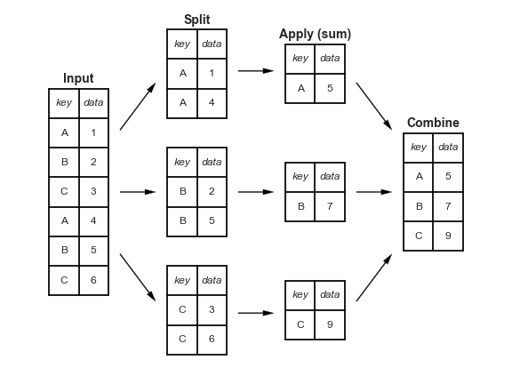

<h1>Pandas基础教程（八）数据聚合与分组</h1>

[TOC]

对于数据分析来说，一个基本的工作就是计算它的一些统计值，比如`sum()`, `mean()`, `median()`, `min()`, `max()`等。这些值描述了数据的一些分布特性以及一些潜在的属性。

本节的例子是一些真实的行星数据，可以通过`seaborn`下载。

```python
import seaborn as sns
planets = sns.load_dataset('planets')
planets.shape

#> (1035, 6)
```

# 1. 一些简单的操作

之前我们在Numpy中介绍了一些方法，pandas中同样也有相应的方法，而且又更丰富的方法：

|方法|描述|
|-|-|
|count()|总的元素个数|
|first(), last()|第一个和最后一个元素|
|mean(), median()|平均值和中值|
|min(), max()|最大值和最小值|
|std(), var()|标准差和方差|
|mad()|平均绝对离差|
|prod()|所有元素之积|
|sum()|所有元素之和|

这些都是比较简单的操作，不做过多介绍。pandas还提供了一个`describe()`方法，用于计算多个统计值：

```python
planets.dropna().describe()

#>           number  orbital_period        mass    distance         year
#> count  498.00000      498.000000  498.000000  498.000000   498.000000
#> mean     1.73494      835.778671    2.509320   52.068213  2007.377510
#> std      1.17572     1469.128259    3.636274   46.596041     4.167284
#> min      1.00000        1.328300    0.003600    1.350000  1989.000000
#> 25%      1.00000       38.272250    0.212500   24.497500  2005.000000
#> 50%      1.00000      357.000000    1.245000   39.940000  2009.000000
#> 75%      2.00000      999.600000    2.867500   59.332500  2011.000000
#> max      6.00000    17337.500000   25.000000  354.000000  2014.000000
```

这些都是比较简单的分徐，要想更深入我们可以借助`groupby`操作。

# 2. Groupby: split, apply, combine

## 2.1 split, apply, combine

我们可以用下面的图来简单说明`groupby`是什么：



从上面的图我们可以清楚的看到`groupby`实现了以下几个操作：

- `split`：根据特定的'key'，把`DataFrame`分割成几块，每一块都有相同的索引。

- `apply`：计算一些函数，通常是一些上面介绍的聚合函数。

- `combine`：将上面计算的结果重新合并成一个`DataFrame`。

```python
df = pd.DataFrame({'key': ['A', 'B', 'C', 'A', 'B', 'C'],
                   'data': range(6)}, columns=['key', 'data'])
df
#>    key  data
#> 0   A     0
#> 1   B     1
#> 2   C     2
#> 3   A     3
#> 4   B     4
#> 5   C     5
```

我们可以将希望分组的列名传入`groupby()`中：

```python
df.groupby('key')

#> <pandas.core.groupby.DataFrameGroupBy object at 0x7fb843a85208>
```

注意，这里没有返回一个`DataFrame`对象而是返回了一个`DataFrameGroupBy`对象，该对象表示我们还没有对分组后的数据进行任何形式的操作，只有有了一些操作之后，它才会返回`DataFrame`:

```python
df.groupby('key').sum()

#>      data
#> key      
#> A       3
#> B       5
#> C       7
```

## 2.2 GroupBy对象

### 2.2.1 列索引

`GroupBy`对象支持列索引，并且返回一个修正后的`GroupBy`对象。

```python
planets.groupby('method')
#> <pandas.core.groupby.DataFrameGroupBy object at 0x1172727b8>

planets.groupby('method')['orbital_period']
#> <pandas.core.groupby.SeriesGroupBy object at 0x117272da0>

planets.groupby('method')['orbital_period'].median()
#> method
#> Astrometry                         631.180000
#> Eclipse Timing Variations         4343.500000
#> Imaging                          27500.000000
#> Microlensing                      3300.000000
#> Orbital Brightness Modulation        0.342887
#> Pulsar Timing                       66.541900
#> Pulsation Timing Variations       1170.000000
#> Radial Velocity                    360.200000
#> Transit                              5.714932
#> Transit Timing Variations           57.011000
#> Name: orbital_period, dtype: float64
```

### 2.2.2 分组迭代

`GroupBy`对象还支持直接对分好的组进行迭代。

```python
for (method, group) in planets.groupby('method'):
    print("{0:30s} shape={1}".format(method, group.shape))

#> Astrometry                     shape=(2, 6)
#> Eclipse Timing Variations      shape=(9, 6)
#> Imaging                        shape=(38, 6)
#> Microlensing                   shape=(23, 6)
#> Orbital Brightness Modulation  shape=(3, 6)
#> Pulsar Timing                  shape=(5, 6)
#> Pulsation Timing Variations    shape=(1, 6)
#> Radial Velocity                shape=(553, 6)
#> Transit                        shape=(397, 6)
#> Transit Timing Variations      shape=(4, 6)
```

## 2.3 aggregate, filter, transform, apply

前面我们集中讨论了‘aggregation’，但实际上还有更多操作可用，比如`aggregaton()`, `filter()`, `transform()`以及`appy()`等。

```python
rng = np.random.RandomState(0)
df = pd.DataFrame({'key': ['A', 'B', 'C', 'A', 'B', 'C'],
                   'data1': range(6),
                   'data2': rng.randint(0, 10, 6)},
                   columns = ['key', 'data1', 'data2'])
df

#>   key  data1  data2
#> 0   A      0      5
#> 1   B      1      0
#> 2   C      2      3
#> 3   A      3      3
#> 4   B      4      7
#> 5   C      5      9
```

### 2.3.1 `aggregation`

w我们已经熟悉了`sum()`,`median()`等操作，实际上`aggregation()`更加灵活，它可以接受字符串、函数、或者列表，并且计算所有的一次性计算。

```python
df.groupby('key').aggregate(['min', np.median, max])

#>     data1            data2           
#>       min median max   min median max
#> key                                  
#> A       0    1.5   3     3    4.0   5
#> B        1    2.5   4     0    3.5   7
#> C       2    3.5   5     3    6.0   9
```

另外，我们还可以传入字典：

```python
#>      data1  data2
#> key              
#> A        0      5
#> B        1      7
#> C        2      9
```

### 2.3.2 `filtering`

`filtering`操作就是使我们可以根据一些条件过滤一些值。比如我们想保留那些标准差大于４的数据：

```python
def filter_func(x):
    return x['data2'].std() > 4

df.groupby('key').std()
#>        data1     data2
#> key                   
#> A    2.12132  1.414214
#> B    2.12132  4.949747
#> C    2.12132  4.242641

df.groupby('key').filter(filter_func)
#>   key  data1  data2
#> 1   B      1      0
#> 2   C      2      3
#> 4   B      4      7
#> 5   C      5      9
```

### 2.3.3 `transformation`

```python
df.groupby('key').transform(lambda x: x - x.mean())

#>    data1  data2
#> 0   -1.5    1.0
#> 1   -1.5   -3.5
#> 2   -1.5   -3.0
#> 3    1.5   -1.0
#> 4    1.5    3.5
#> 5    1.5    3.0
```

### 2.3.4 `apply`

`apply`方法是我们能使用任意函数，包括自定义函数，该函数必须接收一个pandas对象，返回一个pandas对象或者一个标量

```python
def norm_by_data2(x):
    # x is a DataFrame of group values
    x['data1'] /= x['data2'].sum()
    return x

df.groupby('key').apply(norm_by_data2)
#>   key     data1  data2
#> 0   A  0.000000      5
#> 1   B  0.142857      0
#> 2   C  0.166667      3
#> 3   A  0.375000      3
#> 4   B  0.571429      7
#> 5   C  0.416667      9
```

## 2.4 指定`split`的key

前面我们是通过传入一个列名来进行分组，实际上我们还有其他方法。

### 2.4.1 list、array、Serie或者index

如果使用列表或数组作为key的话，它的长度必须和`DataFrame`的长度匹配。

```python
L = [0, 1, 0, 1, 2, 0]
df.groupby(L).sum()

#>    data1  data2
#> 0      7     17
#> 1      4      3
#> 2      4      7
```

### 2.4.2 字典或系列映射数组

```python
df2 = df.set_index('key')
mapping = {'A': 'vowel', 'B': 'consonant', 'C': 'consonant'}

df2
#>      data1  data2
#> key              
#> A        0      5
#> B        1      0
#> C        2      3
#> A        3      3
#> B        4      7
#> C        5      9

df2.groupby(mapping).sum()
#>            data1  data2
#> consonant     12     19
#> vowel          3      8
```


### 2.4.3 任意的python函数

```python
df2.groupby(str.lower).mean()

#>    data1  data2
#> a    1.5    4.0
#> b    2.5    3.5
#> c    3.5    6.0
```

### 2.4.4 有效键列表

更进一步，前面我们提到的那些key还可以组和起来使用。

```python
df2.groupby([str.lower, mapping]).mean()

#>              data1  data2
#> a vowel        1.5    4.0
#> b consonant    2.5    3.5
#> c consonant    3.5    6.0
```
