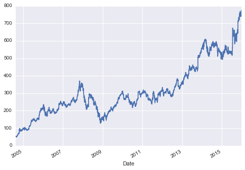
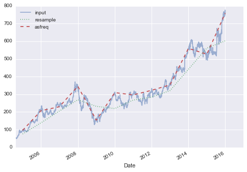
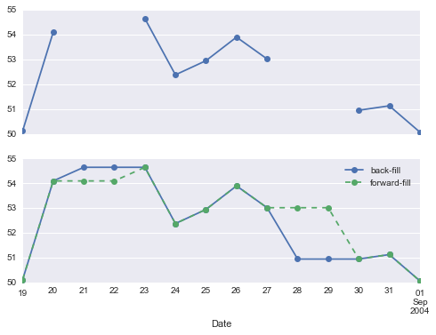
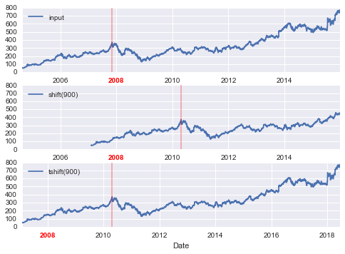
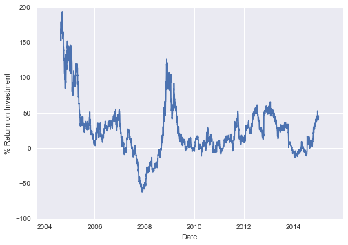
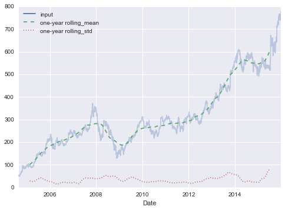

<h1>Pandas基础教程（十一）时间序列</h1>

[TOC]

pandas提供了一套标准的时间序列处理工具和算法，使得我们可以非常高效的处理时间序列，比如切片、聚合、重采样等等。

本节我们讨论以下三种时间序列：

- 时间戳（time stamp）：一个特定的时间点，比如2018年4月2日。
- 时间间隔和时期（time period）：两个特定的时间起点和终点，比如2018年4月2日－2019年4月2日。
- 时间差或持续时间（time deltas）：特定的时间长度，比如20秒。

Python的时间序列处理是一个很重要的话题，尤其在金融领域有着非常重要的应用。本节只做简单的介绍，如果以后有需要的话再深入学习。本文参考的[Working with Time Series](https://jakevdp.github.io/PythonDataScienceHandbook/03.11-working-with-time-series.html)对python原生的日期时间处理模块`datetime`，numpy日期时间处理模块`datetime64`，以及第三方日期时间处理模块`dateutil`等都做了介绍，我们这里跳过这些，直接进入pandas的时间序列。

```python
import numpy as np
import pandas as pd
```

# 1. pandas时间序列：时间索引

当你使用时间戳作为数据索引的时候，pandas的时间序列工具就变得是非有用。

```python
index = pd.DatetimeIndex(['2014-07-04', '2014-08-04',
                          '2015-07-04', '2015-08-04'])
data = pd.Series([0, 1, 2, 3], index=index)
data
#> 2014-07-04    0
#> 2014-08-04    1
#> 2015-07-04    2
#> 2015-08-04    3
#> dtype: int64

data['2014-07-04':'2015-07-04']
#> 2014-07-04    0
#> 2014-08-04    1
#> 2015-07-04    2
#> dtype: int64

data['2015']
#> 2015-07-04    2
#> 2015-08-04    3
#> dtype: int64
```

# 2. pandas时间序列数据结构

- 对于时间戳，pandas提供了`Timestamp`类型。它基于`numpy.datetime64`数据类型，与与之相关的索引类型是`DatetimeIndex`。

- 对于时间时期，pandas提供了`Period`类型，它是基于`numpy.datetime64`编码的固定频率间隔。与之相关的索引类型是`PeriodIndex`。

- 对于时间差，pandas提供了`Timedelta`类型，同样基于`numpy.datetime64`。与之相关的索引结构是`TimedeltaIndex`。

最基本的时间/日期是时间戳`Timestamp`和`DatetimeIndex`。但是我们可以直接使用`pd.to_datetime()`函数来直接解析不同的格式。传入单个日期给`pd.to_datetime()`返回一个`Timestamp`，传入一系列日期默认返回`DatetimeIndex`。

```python
dates = pd.to_datetime([datetime(2015, 7, 3), '4th of July, 2015',
                       '2015-Jul-6', '07-07-2015', '20150708'])
dates

#> DatetimeIndex(['2015-07-03', '2015-07-04', '2015-07-06', '2015-07-07',
#>                '2015-07-08'],
#>               dtype='datetime64[ns]', freq=None)
```

当一个日期减去另一个日期的时候，`TimedeltaIndex`就会被创建：

```python
dates - dates[0]

#> TimedeltaIndex(['0 days', '1 days', '3 days', '4 days', '5 days'], dtype='timedelta64[ns]', freq=None)
```

## 2.1 定期序列

为了方便地创建定期的日期序列，pandas提供了一些函数：`pd.date_range()`创建时间戳，`pd.period_range()`创建时期，`pd.timedelta_range()`创建时间差。默认情况下频率间隔是一天。

```python
pd.date_range('2015-07-03', '2015-07-10')

#> DatetimeIndex(['2015-07-03', '2015-07-04', '2015-07-05', '2015-07-06',
#>                '2015-07-07', '2015-07-08', '2015-07-09', '2015-07-10'],
#>               dtype='datetime64[ns]', freq='D')
```

另外可以不指定终点，而是提供一个时期数：

```python
pd.date_range('2015-07-03', periods=8)

#> DatetimeIndex(['2015-07-03', '2015-07-04', '2015-07-05', '2015-07-06',
#>                '2015-07-07', '2015-07-08', '2015-07-09', '2015-07-10'],
#>               dtype='datetime64[ns]', freq='D')
```

频率间隔可以通过`freq`参数设置，默认是`D`:

```python
pd.date_range('2015-07-03', periods=8, freq='H')

#> DatetimeIndex(['2015-07-03 00:00:00', '2015-07-03 01:00:00',
#>                '2015-07-03 02:00:00', '2015-07-03 03:00:00',
#>                '2015-07-03 04:00:00', '2015-07-03 05:00:00',
#>                '2015-07-03 06:00:00', '2015-07-03 07:00:00'],
#>                dtype='datetime64[ns]', freq='H')
```

类似的

```python
pd.period_range('2015-07', periods=8, freq='M')
#> PeriodIndex(['2015-07', '2015-08', '2015-09', '2015-10', '2015-11', '2015-12',
#>              '2016-01', '2016-02'],
#>              dtype='period[M]', freq='M')

pd.timedelta_range(0, periods=10, freq='H')
#> TimedeltaIndex(['00:00:00', '01:00:00', '02:00:00', '03:00:00', '04:00:00',
#>                 '05:00:00', '06:00:00', '07:00:00', '08:00:00', '09:00:00'],
#>                 dtype='timedelta64[ns]', freq='H')
```

# 3. 频率和偏移

以上这些时间序列处理工具最基础的概念是频率和时间偏移。下表总结了主要的代码表示：

|代码|描述|代码|描述|
|-|-|-|-|
|<code>D</code>|日历天|<code>L</code>|厘秒|
|<code>W</code>|星期|<code>U</code>|毫秒|
|<code>M</code>|月末|<code>N</code>|纳秒|
|<code>Q</code>|季度末|<code>B</code>|工作日|
|<code>A</code>|年末|<code>BM</code>|工作月末|
|<code>H</code>|小时|<code>BQ</code>|工作季末|
|<code>T</code>|分钟|<code>BA</code>|工作年末|
|<code>S</code>|秒|<code>BH</code>|工作时|

上面的月，季度以及周期性频率都被标记为这一时期的终点，如果想变成起始点可以加`S`后缀。

|代码|描述|代码|描述|
|-|-|-|-|
|<code>MS</code>|月初|<code>BMS</code>|工作月初|
|<code>QS</code>|季度初|<code>BQS</code>|工作季初|
|<code>AS</code>|年初|<code>BAS</code>|工作年初|

另外，还可以通过加后缀的方法改变季度或年的月份等。

 - `Q-JAN`, `BQ-FEB`, `BQS-APR`等等；
 - `A-JAN`, `BA-FEB`, `BAS-APR`等等。

 类似的，星期也可以分解成周一，周二...

 - `W-SUN`, `W-MON`, `W-WED`等等

 以上这些代码还可以与数字结合来表示频率，　例如我们要表示2小时30分的频率：

```python
pd.timedelta_range(0, periods=9, freq="2H30T")

#> TimedeltaIndex(['00:00:00', '02:30:00', '05:00:00', '07:30:00', '10:00:00',
#>                 '12:30:00', '15:00:00', '17:30:00', '20:00:00'],
#>                 dtype='timedelta64[ns]', freq='150T')
```

以上这些代码表示的含义还可以通过`pd.tseries.offsets`模块表示：

```python
from pandas.tseries.offsets import BDay
pd.date_range('2015-07-01', periods=5, freq=BDay())

#> DatetimeIndex(['2015-07-01', '2015-07-02', '2015-07-03', '2015-07-06',
#>                '2015-07-07'],
#>                dtype='datetime64[ns]', freq='B')
```

更加详细的讨论可以看[DateOffset](http://pandas.pydata.org/pandas-docs/stable/timeseries.html#dateoffset-objects)。

# 4. 重采样，转移，加窗口

我们以一些真实的金融数据为例讲解，`pandas-datareader`(可通过`conda install pandas-datareader`来安装, 如果)包包含谷歌，雅虎等公司的金融数据。

```python
from pandas_datareader import data

goog = data.DataReader('GOOG', start='2004', end='2016',
                       data_source='google')
goog.head()

#>  	Open 	High 	Low 	Close 	Volume
#> Date 					
#> 2004-08-19 	49.96 	51.98 	47.93 	50.12 	NaN
#> 2004-08-20 	50.69 	54.49 	50.20 	54.10 	NaN
#> 2004-08-23 	55.32 	56.68 	54.47 	54.65 	NaN
#> 2004-08-24 	55.56 	55.74 	51.73 	52.38 	NaN
#> 2004-08-25 	52.43 	53.95 	51.89 	52.95 	NaN
```

简单起见，我们只是用收盘价格

```python
goog = goog['Close']
```

为了更好的说明问题，我们可以利用matplotlib对数据进行可视化，关于matplotlib可以通过[Python for Data Analysis](http://shop.oreilly.com/product/0636920023784.do)这本书进行学习，也可以通过官网的gallary进行学习，我个人当时是在官网看了大量的实例，有什么需求直接去官网找例子，都很方便。本系列学习笔记不会包含数据可视化部分。

```python
import matplotlib.pyplot as plt

goog.plot()
```



## 4.1 重采样及频率转换

重采样(resampling)指的是将时间序列从一个频率转换到另一个频率的处理过程。将高频数据聚合到低频称为降采样（downsampling），将低频数据转换到高频则称为升采样（upsampling）。除此以外还存在一种采样方式既不是升采样，也不是降采样，比如`W-WED`转换成`W-FRI`。

可以通过`resample()`函数来实现，也可以通过更简单的方式`asfreq()`函数来实现。两者基本的不同点在于`resample()`是一种数据聚合方式`asfreq()`是一种数据选取方式。

```python
goog.plot(alpha=0.5, style='-')
goog.resample('BA').mean().plot(style=':')
goog.asfreq('BA').plot(style='--');
plt.legend(['input', 'resample', 'asfreq'],
            loc='upper left')
```



`resample()`的处理过程是取整年的数据的平均值，而`asfreq()`是选取年末的时间点的数据。


对于升采样来说，`resample()`与`asfreq()`是等效的。对于空置采样点都会用`NaN`来进行填充。就像`pd.fillna()`方法，`asfreq()`接受一个参数`method`可指定缺失值的填充方法。`ffill`表示与前面的值保持一致，`bfill`表示与后面的值保持一致等等。

```python
fig, ax = plt.subplots(2, sharex=True)
data = goog.iloc[:10]

data.asfreq('D').plot(ax=ax[0], marker='o')

data.asfreq('D', method='bfill').plot(ax=ax[1], style='-o')
data.asfreq('D', method='ffill').plot(ax=ax[1], style='--o')
ax[1].legend(["back-fill", "forward-fill"])
```



## 4.2 时间移动

另一个与时间序列相关的操作是数据在时间轴的移动。pandas提供了两个相关的函数：`shift()`和`tshift()`，两者的不同是`shift()`移动的是数据，`tshift()`移动的是时间轴(索引)。

```python
fig, ax = plt.subplots(3, sharey=True)

# apply a frequency to the data
goog = goog.asfreq('D', method='pad')

goog.plot(ax=ax[0])
goog.shift(900).plot(ax=ax[1])
goog.tshift(900).plot(ax=ax[2])

# legends and annotations
local_max = pd.to_datetime('2007-11-05')
offset = pd.Timedelta(900, 'D')

ax[0].legend(['input'], loc=2)
ax[0].get_xticklabels()[2].set(weight='heavy', color='red')
ax[0].axvline(local_max, alpha=0.3, color='red')

ax[1].legend(['shift(900)'], loc=2)
ax[1].get_xticklabels()[2].set(weight='heavy', color='red')
ax[1].axvline(local_max + offset, alpha=0.3, color='red')

ax[2].legend(['tshift(900)'], loc=2)
ax[2].get_xticklabels()[1].set(weight='heavy', color='red')
ax[2].axvline(local_max + offset, alpha=0.3, color='red')
```



时移一个重要作用即使计算一段时间内的差别，比如计算谷歌股票一年的投资回报率：

```python
ROI = 100 * (goog.tshift(-365) / goog - 1)
ROI.plot()
plt.ylabel('% Return on Investment')
```



## 4.3 滚动窗口

滚动统计是时间序列的又一重要的操作。可以通过`Series`和`DataFrame`的`rolling()`方法实现，返回类似于`groupby`的操作，同样也有许多数据聚合的操作。

```python
rolling = goog.rolling(365, center=True)

data = pd.DataFrame({'input': goog,
                     'one-year rolling_mean': rolling.mean(),
                     'one-year rolling_std': rolling.std()})
ax = data.plot(style=['-', '--', ':'])
ax.lines[0].set_alpha(0.3)
```



# 5. 更多操作

以上就是我们对pandas时间序列操作的一些简单介绍，如果想要更多、更加深入的学习可以参考
[ Python for Data Analysis ](http://shop.oreilly.com/product/0636920023784.do)。
